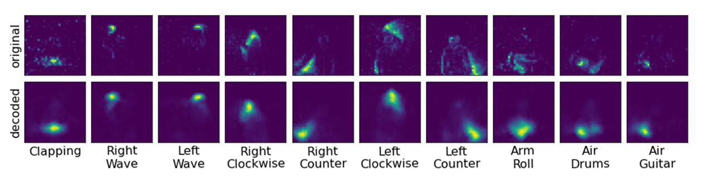

# Accenture_Hybrid_Guided_VAE

The [Hybrid Guided VAE](https://arxiv.org/abs/2104.00165) (HG-VAE) is an open source library based on pytorch.

 HG-VAE learns disentangled feature representations of event-based vision data streams by encoding an event stream with a spiking Variational Auto Encoder (VAE).


Then encoded features are guided with supervised learning to disentangle certain features, such as the features that characterize different digits shown in this T-SNE plot which clusters the digits based on their disentangled encoded representations.


The features can then be decoded and visualized with a convolutional neural network decoder.



 [Accenture Labs](https://www.accenture.com/us-en/about/accenture-labs-index) created the HG-VAE in collaboration with the [UCI NMI Lab](https://nmi-lab.org/).

 By open-sourcing the components that we used to enable training SNN models with our method, we hope to encourage adoption to other datasets, problem domains, and collaboration for improvements to the methods.

 For more details refer to this [paper](https://arxiv.org/abs/2104.00165).

 If you use this library for your own work please [cite it](#how-to-cite).

## Table of Contents

+ [**Installation**](#installation)
+ [**Datasets**](#datasets)
+ [**Training Models**](#training-models)
+ [**Loading Trained Models**](#loading-trained-models)
+ [**Licensing**](#licensing)
+ [**How to Contribute**](#how-to-contribute)
+ [**How to Cite**](#how-to-cite)
+ [**Contacts**](#contacts)

## Installation

#### Prerequisites

* Linux
* Python 3.6+

#### Provision a Virtual Environment

Create and activate a virtual environment (conda)

```bash
$ python3 -m venv hgvae
source hgvae/bin/activate
```

To clone the repository and install the required dependencies run the following:

```bash
$ git clone https://github.com/kennetms/Accenture_Hybrid_Guided_VAE
$ cd Accenture_Hybrid_Guided_VAE
$ pip install -r requirements.txt
```

The HG-VAE is built on pytorch.
To install the correct pytorch version for your machine visit the link [here](https://pytorch.org/get-started/locally/)

## Datasets

#### DVSGestures

To install the [DVSGestures](https://research.ibm.com/interactive/dvsgesture/) dataset to train and run Hybrid Guided VAE models, run the following:


```bash
$ cd data
$ wget https://www.dropbox.com/s/3v0t4hn0c9asior/dvs_zipped.zip\?dl=0
$ unzip 'dvs_zipped.zip?dl=0'
$ cd ..
```

#### N-MNIST

The torchenuromorphic library will automatically install the [N-MNIST](https://www.garrickorchard.com/datasets/n-mnist) dataset if it is not on your local machine
when you try to train or run an N-MNIST model.


## Training Models
Currently the HG-VAE library supports training three different kinds of models.

Two use the DVSGestures dataset, while the other uses the NMNIST dataset

To train and evaluate on DVSGestures run the following line:
```bash
$ cd dvs_gestures
$ python train_gestures.py
```

To train and evaluate with DVSGestures guided on lighting conditions:
```bash
$ cd dvs_gesture_lighting
$ python train_lights.py
```
To train and evaluate on the N-MNIST digits:
```bash
$ cd nmnist
$ python train_nmnist.py
```

To train a model with SLAYER-Loihi that is compatible with Loihi run the .ipynb notebook in the snn_loihi_example folder.

```bash
$ cd slayer_loihi_example
Loihi_Simulator_training.ipynb
```

Models typically take several hours to train, with intermediate results and models stored in the logs/ directory.

## Loading Trained Models
Example models with their parameters can be found in the subfolders named
```bash
example_model
```

Checkpoints with saved models are placed in the logs directory.

Intermediate results can be viewed with tensorboard.

For example:
```bash
$ tensorboard --logdir logs/train_gestures/default/Mar23_20-57-42 --port 6007 --bind_all
```

The files in the parameters/ directory can be changed to load a model from a saved checkpoint.

For example, to resume a model from a checkpoint edit the line
```bash
resume_from: None
```

to the checkpoints folder of the model you want to resume from.
For example, if you wanted to use the provided DVSGestures model:
```bash
resume_from: ../dvs_gestures/example_model/checkpoints/
```

To train a model from scratch, change the line to:
```bash
resume_from: None
```

## Licensing
These assets are licensed under the [Apache 2.0 License](https://www.apache.org/licenses/LICENSE-2.0.txt).

## How to Contribute
We welcome community contributions, especially for new models, improvements, and documentation.

If you'd like to contribute your work to the repository you can do so by opening up a pull request.  

## How to Cite

If you use or adopt the models, code, or methods presented here please cite our work as follows:

```
@misc{stewart2021gesture,
      author={Kenneth Stewart and Andreea Danielescu and Lazar Supic and Timothy Shea and Emre Neftci},
      title={Gesture Similarity Analysis on Event Data Using a Hybrid Guided Variational Auto Encoder},
      year={2021},
      eprint={2104.00165},
      archivePrefix={arXiv},
      primaryClass={cs.NE}
}
```

## Contacts

Andreea Danielescu\
​*Future Technologies, Accenture Labs*\
[andreea.danielescu@accenture.com](mailto:@accenture.com?subject=[GitHub])

​Kenneth Stewart\
​*PhD Candidate, University of California, Irvine*\
​[kennetms@uci.edu](mailto:kennetms@uci.edu?subject=[GitHub])
